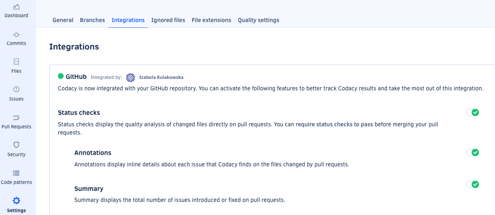
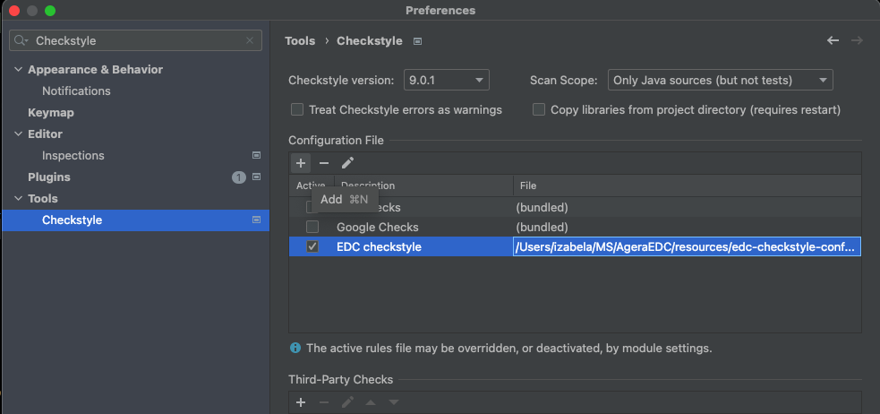
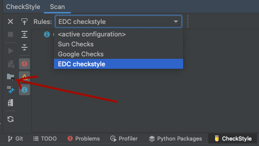
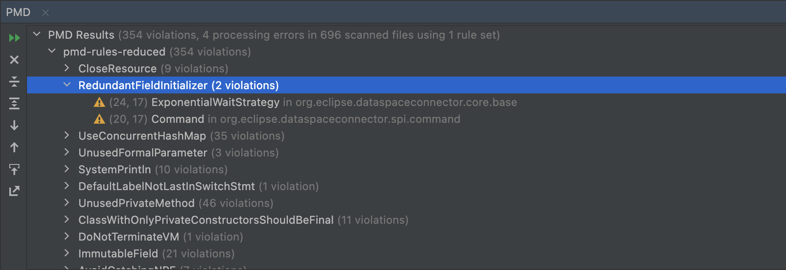
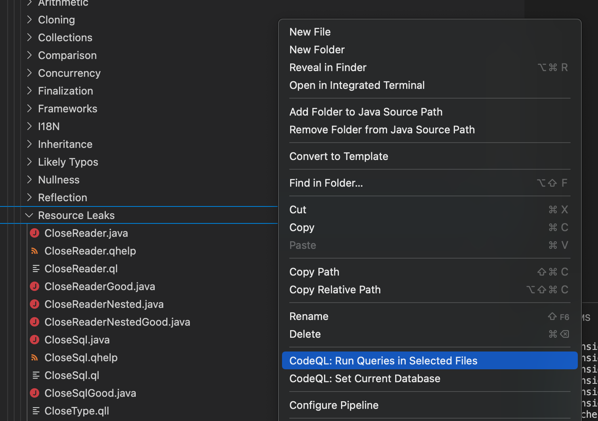
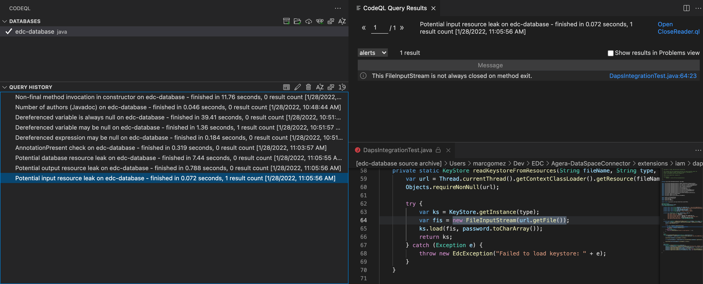

# ADR on Code Quality

# Overview of tools

| Tool       | Analysis Type | Description                                                                                                                                                                                                            |
|------------|---------------|------------------------------------------------------------------------------------------------------------------------------------------------------------------------------------------------------------------------|
| Checkstyle | Source code   | Focuses on coding style making sure a team adheres to some standards including naming, braces, indentation, javadoc on public methods, etc.                                                                            |
| PMD        | Source code   | Focuses on common programming flaws like unused variables, empty catch blocks, unnecessary object creation. PMD also tells you about the [Cyclomatic complexity](https://en.wikipedia.org/wiki/Cyclomatic_complexity). |
| Spotbugs   | Byte code     | Focuses on common programming flaws that can not be found with source code analysis like infinite loop, equals method always returns true, opened streams, a collection which contains itself, etc.                    |
| CodeQL     | Source code   | A semantic code analysis engine. CodeQL treats code as data, allowing you to find potential vulnerabilities in your code with greater confidence than traditional static analyzers.                                    |

## Checkstyle 

[Checkstyle](https://checkstyle.org/) is a static code analysis tool to help programmers write Java code that adheres to a coding standard (coding style, naming patterns, indentation, etc..)

### Running Checkstyle

Use the [Checkstyle Gradle Plugin](https://docs.gradle.org/current/userguide/checkstyle_plugin.html) to run Checkstyle.

```kotlin
plugins {
    checkstyle
}

```

Checkstyle can be configured using [properties](https://docs.gradle.org/current/dsl/org.gradle.api.plugins.quality.CheckstyleExtension.html):

```kotlin
checkstyle {
        configFile = rootProject.file("resources/edc-checkstyle-config.xml")
        maxErrors = 0 
    }
```

Checkstyle generates reports which can be configured: 

```kotlin
tasks.withType<Checkstyle> {
        reports {
            html.required.set(false)
            xml.required.set(false)
        }
    }
```

### Usage of Checkstyle in EDC

Checkstyle is configured in EDC repository running on every build. It's configured to break the build on every error or warning.

Checkstyle is set up to run explicitly in [Github Workflow](./.github/workflows/verify.yaml) on every change in a Pull Request posting comments on every 
failure:


More information about Checktyle in EDC can be found in [the doc about the style guide](./styleguide.md).

### Running Checkstyle with Codacy

Checkstyle is available as a built-in tool in Codacy. By clicking on the tool the Checkstyle rule set can be configured. 


With this feature toggled Codacy scans the code and can apply the checks on the PRs. From the Codacy dashboard we can see the issues found by Checkstyle 
with an explanation why it's an issue:


Codacy offers also an integration with Github Actions checks that can be applied on new PRs.

It can be enabled from Codacy website -> Settings -> Integrations



With that we can see the checks reports under the PRs in Github:


Going into details we can see a link to the issues report on Codacy:


Using Checkstyle with Codacy has an advantage of keeping all checks in the same shared dashboard where all code quality analysis from different tools are 
combined. It helps to monitor the current status of the code quality in the repository. 
However, if the goal is to have checks reported in the PR then running Checkstyle explicitly in Github Actions offers better visibility as the checks are 
posted directly in the PR review discussion by Github Actions bot. 

### Checkstyle in the Intellij 

EDC style guide recommends using [Checkstyle-IDEA plugin](https://plugins.jetbrains.com/plugin/1065-checkstyle-idea). 
To use [edc-checkstyle-config.xml](./resources/edc-checkstyle-config.xml) config file we have to create new Active configuration in checkstyle preferences:



After installing the plugin it should be visible as one of the tool windows (View -> Tool windows -> Checkstyle). Then to run the scan we have to pick the 
created configuration and click e.g. "Check Project" or "Check current file".




## PMD

PMD is a Java source code analyzer that finds common programming flaws like unused variables, empty catch blocks, unnecessary object creation, and so forth. It provides predefined rule sets that can be used out of the box grouped in different categories: bestpractices, documentation, multithreading, performance, etc. Often these defaults are a bit too extensive and lead to a big amount of issues detected, so it is advisable to create a custom rule set for the most meaningful patterns. The [pmd-rules.xml](./resources/pmd-rules.xml) file defines a custom rule set that was used in a [previous project](https://github.com/catenax/tractusx/blob/main/coreservices/partsrelationshipservice/ci/pmd-rules.xml)

### Running PMD with the IntelliJ plugin

The [Intellij PMD plugin](https://plugins.jetbrains.com/plugin/1137-pmdplugin) runs PMD directly from the IDE with either a predefined set of rules or custom ones from the project. On a machine with a 2.3Ghz 8-Core Intel Core i9 CPU running the Intellij plugin around 3 minutes.

Unfortunately the plugin does not allow to configure the minimum priority threshold for issues, leading to a full-blown violations report.



### Running PMD with Gradle

Use the [PMD Gradle Plugin](https://docs.gradle.org/current/userguide/pmd_plugin.html) to run PMD. On a machine with a 2.3Ghz 8-Core Intel Core i9 CPU running `gradle pmdMain` takes 1.5 minutes.

The plugin reports a series of warnings for rules that will be deprecated in the next PMD 7.0.0 version. See [PMD documentation](https://pmd.github.io/latest/pmd_next_major_development.html#list-of-currently-deprecated-rules) for more information.

```kotlin
plugins {
    pmd
}

pmd {
    isConsoleOutput = true
    toolVersion = "6.41.0"
    ruleSets = listOf("resources/pmd-rules-reduced.xml")
}

tasks.pmdTest {  // do not run PMD on test code
    enabled = false
}
```

The `rulesMinimumPriority` field allows to set the minimum priority level of violations for failing the build.

An own report is generated per each Gradle module. This is not practical as one has to navigate to the different modules to get to the findings, a central aggregated overview would come handy for visualization. There is a [Maven plugin](https://maven.apache.org/plugins/maven-pmd-plugin//aggregate-pmd-mojo.html) to aggregate PMD reports but unfortunately this does not seem to be the case for Gradle. A custom aggregation solution would need to be built in this case. 

A pragmatic setup could be to use the Gradle setup only to enforce that no open PMD issues remain when running CI, while using IDE plugins to visualize and fix issues locally.

### Running PMD with Codacy

PMD is also available as a built-in tool in Codacy. It can be configured in the same way as [Checkstyle](#running-checkstyle-with-codacy).

### Reported EDC violations

Running PMD on EDC results in over 27000 violations at the time of writing with the predefined rulesets. Using the [pmd-rules.xml](./resources/pmd-rules.xml) ruleset we end up with 15000 violations.

A quick scan through the findings reveals that most of them are low priority issues like "short class name", "comment size", "too many imports", "method argument could be final". Some others are false positives that don't apply for the code in question like "use concurrent hashmap" in a single-threaded context or "empty catch block" in a code area where this is expected. Among them some interesting items can be found like "mutable static state" or "avoid nested if statements" for a code piece with 3 nested ifs.

Taking a much more targeted [pmd-rules-reduced.xml](./resources/pmd-rules-reduced.xml) ruleset focusing on just few of the most important violations reduces noise and brings the total amount of violations to a much more manageable ~350 violations spread accross 50 different rules. We encourage starting with a focused small ruleset and add rules bit by bit whenever needed. Rules leading to too many false positives need to be reevaluated if they really bring value and deleted if deemed necessary.

| Priority | Rule | Rule Set | URL | Occurrences |
|----------| ---- | -------- | ---- | ---------- |
| 🚨 1     | AbstractClassWithoutAnyMethod | Design | https://pmd.github.io/pmd-6.41.0/pmd_rules_java_design.html#abstractclasswithoutanymethod | 1 |
| 🚨 1     | ClassWithOnlyPrivateConstructorsShouldBeFinal | Design | https://pmd.github.io/pmd-6.41.0/pmd_rules_java_design.html#classwithonlyprivateconstructorsshouldbefinal | 11 |
| 🚨 1     | ConstructorCallsOverridableMethod | Error Prone | https://pmd.github.io/pmd-6.41.0/pmd_rules_java_errorprone.html#constructorcallsoverridablemethod | 3 |
| ⚠️ 2     | AvoidReassigningParameters | Best Practices | https://pmd.github.io/pmd-6.41.0/pmd_rules_java_bestpractices.html#avoidreassigningparameters | 10 |
| ⚠️ 2     | SystemPrintln | Best Practices | https://pmd.github.io/pmd-6.41.0/pmd_rules_java_bestpractices.html#systemprintln | 10 |
| ❕ 3      | AbstractClassWithoutAbstractMethod | Best Practices | https://pmd.github.io/pmd-6.41.0/pmd_rules_java_bestpractices.html#abstractclasswithoutabstractmethod | 7 |
| ❕ 3      | AddEmptyString | Performance | https://pmd.github.io/pmd-6.41.0/pmd_rules_java_performance.html#addemptystring | 2 |
| ❕ 3        | ArrayIsStoredDirectly | Best Practices | https://pmd.github.io/pmd-6.41.0/pmd_rules_java_bestpractices.html#arrayisstoreddirectly |
| ❕ 3        | AssignmentInOperand | Error Prone | https://pmd.github.io/pmd-6.41.0/pmd_rules_java_errorprone.html#assignmentinoperand |
| ❕ 3        | AssignmentToNonFinalStatic | Error Prone | https://pmd.github.io/pmd-6.41.0/pmd_rules_java_errorprone.html#assignmenttononfinalstatic |
| ❕ 3        | AvoidCatchingNPE | Error Prone | https://pmd.github.io/pmd-6.41.0/pmd_rules_java_errorprone.html#avoidcatchingnpe |
| ❕ 3        | AvoidCatchingThrowable | Error Prone | https://pmd.github.io/pmd-6.41.0/pmd_rules_java_errorprone.html#avoidcatchingthrowable |
| ❕ 3        | AvoidDeeplyNestedIfStmts | Design | https://pmd.github.io/pmd-6.41.0/pmd_rules_java_design.html#avoiddeeplynestedifstmts |
| ❕ 3        | AvoidDuplicateLiterals | Error Prone | https://pmd.github.io/pmd-6.41.0/pmd_rules_java_errorprone.html#avoidduplicateliterals |
| ❕ 3        | AvoidInstantiatingObjectsInLoops | Performance | https://pmd.github.io/pmd-6.41.0/pmd_rules_java_performance.html#avoidinstantiatingobjectsinloops |
| ❕ 3        | AvoidPrintStackTrace | Best Practices | https://pmd.github.io/pmd-6.41.0/pmd_rules_java_bestpractices.html#avoidprintstacktrace |
| ❕ 3        | AvoidReassigningLoopVariables | Best Practices | https://pmd.github.io/pmd-6.41.0/pmd_rules_java_bestpractices.html#avoidreassigningloopvariables |
| ❕ 3        | AvoidRethrowingException | Design | https://pmd.github.io/pmd-6.41.0/pmd_rules_java_design.html#avoidrethrowingexception |
| ❕ 3        | CloseResource | Error Prone | https://pmd.github.io/pmd-6.41.0/pmd_rules_java_errorprone.html#closeresource |
| ❕ 3        | CompareObjectsWithEquals | Error Prone | https://pmd.github.io/pmd-6.41.0/pmd_rules_java_errorprone.html#compareobjectswithequals |
| ❕ 3        | ConstantsInInterface | Best Practices | https://pmd.github.io/pmd-6.41.0/pmd_rules_java_bestpractices.html#constantsininterface |
| ❕ 3        | CouplingBetweenObjects | Design | https://pmd.github.io/pmd-6.41.0/pmd_rules_java_design.html#couplingbetweenobjects |
| ❕ 3        | CyclomaticComplexity | Design | https://pmd.github.io/pmd-6.41.0/pmd_rules_java_design.html#cyclomaticcomplexity |
| ❕ 3        | DefaultLabelNotLastInSwitchStmt | Best Practices | https://pmd.github.io/pmd-6.41.0/pmd_rules_java_bestpractices.html#defaultlabelnotlastinswitchstmt |
| ❕ 3        | DoNotTerminateVM | Error Prone | https://pmd.github.io/pmd-6.41.0/pmd_rules_java_errorprone.html#donotterminatevm |
| ❕ 3        | DoubleBraceInitialization | Best Practices | https://pmd.github.io/pmd-6.41.0/pmd_rules_java_bestpractices.html#doublebraceinitialization |
| ❕ 3        | EmptyCatchBlock | Error Prone | https://pmd.github.io/pmd-6.41.0/pmd_rules_java_errorprone.html#emptycatchblock |
| ❕ 3        | EmptyIfStmt | Error Prone | https://pmd.github.io/pmd-6.41.0/pmd_rules_java_errorprone.html#emptyifstmt |
| ❕ 3        | FinalFieldCouldBeStatic | Design | https://pmd.github.io/pmd-6.41.0/pmd_rules_java_design.html#finalfieldcouldbestatic |
| ❕ 3        | ForLoopVariableCount | Best Practices | https://pmd.github.io/pmd-6.41.0/pmd_rules_java_bestpractices.html#forloopvariablecount |
| ❕ 3        | GodClass | Design | https://pmd.github.io/pmd-6.41.0/pmd_rules_java_design.html#godclass |
| ❕ 3        | IdempotentOperations | Error Prone | https://pmd.github.io/pmd-6.41.0/pmd_rules_java_errorprone.html#idempotentoperations |
| ❕ 3        | ImmutableField | Design | https://pmd.github.io/pmd-6.41.0/pmd_rules_java_design.html#immutablefield |
| ❕ 3        | LiteralsFirstInComparisons | Best Practices | https://pmd.github.io/pmd-6.41.0/pmd_rules_java_bestpractices.html#literalsfirstincomparisons |
| ❕ 3        | LooseCoupling | Best Practices | https://pmd.github.io/pmd-6.41.0/pmd_rules_java_bestpractices.html#loosecoupling |
| ❕ 3        | MethodReturnsInternalArray | Best Practices | https://pmd.github.io/pmd-6.41.0/pmd_rules_java_bestpractices.html#methodreturnsinternalarray |
| ❕ 3        | MissingOverride | Best Practices | https://pmd.github.io/pmd-6.41.0/pmd_rules_java_bestpractices.html#missingoverride |
| ❕ 3        | NullAssignment | Error Prone | https://pmd.github.io/pmd-6.41.0/pmd_rules_java_errorprone.html#nullassignment |
| ❕ 3        | RedundantFieldInitializer | Performance | https://pmd.github.io/pmd-6.41.0/pmd_rules_java_performance.html#redundantfieldinitializer |
| ❕ 3        | SimpleDateFormatNeedsLocale | Error Prone | https://pmd.github.io/pmd-6.41.0/pmd_rules_java_errorprone.html#simpledateformatneedslocale |
| ❕ 3        | SimplifyBooleanReturns | Design | https://pmd.github.io/pmd-6.41.0/pmd_rules_java_design.html#simplifybooleanreturns |
| ❕ 3        | SimplifyStartsWith | Performance | https://pmd.github.io/pmd-6.41.0/pmd_rules_java_performance.html#simplifystartswith |
| ❕ 3        | SingularField | Design | https://pmd.github.io/pmd-6.41.0/pmd_rules_java_design.html#singularfield |
| ❕ 3        | UnusedFormalParameter | Best Practices | https://pmd.github.io/pmd-6.41.0/pmd_rules_java_bestpractices.html#unusedformalparameter |
| ❕ 3        | UnusedLocalVariable | Best Practices | https://pmd.github.io/pmd-6.41.0/pmd_rules_java_bestpractices.html#unusedlocalvariable |
| ❕ 3        | UnusedPrivateField | Best Practices | https://pmd.github.io/pmd-6.41.0/pmd_rules_java_bestpractices.html#unusedprivatefield |
| ❕ 3        | UnusedPrivateMethod | Best Practices | https://pmd.github.io/pmd-6.41.0/pmd_rules_java_bestpractices.html#unusedprivatemethod |
| ❕ 3        | UseCollectionIsEmpty | Best Practices | https://pmd.github.io/pmd-6.41.0/pmd_rules_java_bestpractices.html#usecollectionisempty |
| ❕ 3        | UseConcurrentHashMap | Multithreading | https://pmd.github.io/pmd-6.41.0/pmd_rules_java_multithreading.html#useconcurrenthashmap |
| ❕ 3        | UseIndexOfChar | Performance | https://pmd.github.io/pmd-6.41.0/pmd_rules_java_performance.html#useindexofchar |

A quick look through the top priority issues reveals that although a quick fix for the issues is easy to implement, often bugs uncover suboptimal software design constructs. Fixing the software design issues might lead to implementation tasks not to be underestimated.  

## Spotbugs

[Spotbugs](https://spotbugs.github.io/) is a program which uses static analysis to look for bugs in Java code. It looks for instances of “bug patterns” — code instances that are likely to be errors by inspecting Java bytecode.

### Running SpotBugs with the IntelliJ plugin

The [Spotbugs Intellij plugin](https://plugins.jetbrains.com/plugin/14014-spotbugs) runs Spotbugs directly from the IDE. This is the most effective way to look and fix Spotbugs issues from the developers perspective. Running the IntelliJ plugin on a machine with a 2.3Ghz 8-Core Intel Core i9 CPU running takes around 1 minute. 


### Running SpotBugs with Gradle

Use the [Spotbugs Gradle Plugin](https://github.com/spotbugs/spotbugs-gradle-plugin) to run Spotbugs. 

The plugin is configured to generate html reports and with a file for accepted exclusions. An initial set of exclusions can be taken from sample open source projects like the [Azure Java SDK](https://github.com/Azure/azure-sdk-for-java/blob/main/eng/code-quality-reports/src/main/resources/spotbugs/spotbugs-exclude.xml). 

Running `gradle spotbugsMain` takes around 3.5 minutes on a machine with a 2.3Ghz 8-Core Intel Core i9 CPU.

```kotlin
plugins {
    id("com.github.spotbugs") version "5.0.5"
}

dependencies {
    spotbugsPlugins("com.h3xstream.findsecbugs:findsecbugs-plugin:1.11.0")
}

spotbugs {
    ignoreFailures.set(true) // if false, build fails on bugs
    excludeFilter.set(file("$rootDir/resources/spotbugs-excludes.xml"))
}

tasks.spotbugsMain {
    reports.create("html") {
        required.set(true)
        outputLocation.set(file("$buildDir/reports/spotbugs.html"))
        setStylesheet("fancy-hist.xsl")
    }
}
```

The [Find Security Bugs](https://find-sec-bugs.github.io/) plugin extends Spotbugs with additional security checks.

Spotbugs can be quite resource intense. The [effort configuration](https://spotbugs.readthedocs.io/en/stable/effort.html) helps tune Spotbugs accordingly for each individual project.

Similar to PMD, an own report is generated per each Gradle module, which is not practical. Unfortunately there is no good solution for this other than creating a custom solution with a XSL aggregation/transformation of Spotbugs XML output files. 

A pragmatic setup would to use the Gradle setup only to enforce that no open Spotbugs issues remain when running CI, while using IDE plugins to visualize and fix issues locally.


### Running Spotbugs with Codacy

According to [the docs](https://docs.codacy.com/related-tools/local-analysis/running-spotbugs/), codacy supports Spotbugs integration. 

We configured a [pipeline](.github/workflows/codacy-analysis.yaml) to run Spotbugs on pushes, but we were not able to get the analysis running, as it seems that classes and sources are not detected properly despite trying to define class/source directories as described in the [documentation](https://docs.codacy.com/related-tools/local-analysis/running-spotbugs/#detecting-sources-and-compiled-classes). See [failing CI run](https://github.com/Agera-CatenaX/EclipseDataSpaceConnector/runs/4925578885?check_suite_focus=true).

```
Error executing the tool
java.io.IOException: IOException while scanning codebases
	at edu.umd.cs.findbugs.FindBugs2.execute(FindBugs2.java:311)
	at com.codacy.tools.spotbugs.SpotBugs$.$anonfun$runTool$1(SpotBugs.scala:113)
	at scala.util.Try$.apply(Try.scala:213)
	at com.codacy.tools.spotbugs.SpotBugs$.runTool(SpotBugs.scala:82)
	at com.codacy.tools.spotbugs.SpotBugs$.$anonfun$apply$9(SpotBugs.scala:52)
	at scala.collection.TraversableLike.$anonfun$map$1(TraversableLike.scala:285)
	at scala.collection.immutable.Set$Set2.foreach(Set.scala:181)
	at scala.collection.TraversableLike.map(TraversableLike.scala:285)
	at scala.collection.TraversableLike.map$(TraversableLike.scala:278)
	at scala.collection.AbstractSet.scala$collection$SetLike$$super$map(Set.scala:53)
	at scala.collection.SetLike.map(SetLike.scala:105)
	at scala.collection.SetLike.map$(SetLike.scala:105)
	at scala.collection.AbstractSet.map(Set.scala:53)
	at com.codacy.tools.spotbugs.SpotBugs$.apply(SpotBugs.scala:53)
	at com.codacy.tools.scala.seed.DockerEngine.executeTool(DockerEngine.scala:53)
	at com.codacy.tools.scala.seed.DockerEngine.$anonfun$main$2(DockerEngine.scala:35)
	at scala.util.Success.$anonfun$map$1(Try.scala:255)
	at scala.util.Success.map(Try.scala:213)
	at com.codacy.tools.scala.seed.DockerEngine.$anonfun$main$1(DockerEngine.scala:27)
	at scala.util.Success.flatMap(Try.scala:251)
	at com.codacy.tools.scala.seed.DockerEngine.main(DockerEngine.scala:26)
	at com.codacy.tools.spotbugs.Engine.main(Engine.scala)
Caused by: edu.umd.cs.findbugs.classfile.ResourceNotFoundException: Resource not found: java/lang/Object.class
	at edu.umd.cs.findbugs.classfile.impl.ClassPathImpl.lookupResource(ClassPathImpl.java:162)
	at edu.umd.cs.findbugs.classfile.impl.ClassPathBuilder.build(ClassPathBuilder.java:282)
	at edu.umd.cs.findbugs.FindBugs2.buildClassPath(FindBugs2.java:708)
	at edu.umd.cs.findbugs.FindBugs2.execute(FindBugs2.java:245)
	... 21 more
```

### Reported EDC issues

Spotbugs reports 303 issues spread across 27 bug patterns of high and medium priority. See [Spotbugs documentation](https://spotbugs.readthedocs.io/en/stable/bugDescriptions.html).

| Priority | Pattern                                 | Description                                          | Category       | Count |
| -------- | --------------------------------------- | ---------------------------------------------------- | -------------- | ----- |
| 🚨 1      | DM_DEFAULT_ENCODING                     | Reliance on  default encoding                        | I18N           | 11    |
| 🚨 1      | DMI_RANDOM_USED_ONLY_ONCE               | Random object created and used only once             | BAD_PRACTICE   | 5     |
| 🚨 1      | MS_SHOULD_BE_FINAL                      | Field isn't final but should be                      | MALICIOUS_CODE | 3     |
| 🚨 1      | NP_NONNULL_PARAM_VIOLATION              | Method call passes null to a non-null parameter      | CORRECTNESS    | 1     |
| ⚠️ 2      | DCN_NULLPOINTER_EXCEPTION               | NullPointerException caught                          | STYLE          | 7     |
| ⚠️ 2      | DLS_DEAD_LOCAL_STORE                    | Dead store to local variable                         | STYLE          | 2     |
| ⚠️ 2      | EI_EXPOSE_REP                           | May exposeinternal representation by returning reference to mutable object | MALICIOUS_CODE | 99    |
| ⚠️ 2      | EI_EXPOSE_REP2                          | May expose internal representation by incorporating  reference to mutable object | MALICIOUS_CODE | 130   |
| ⚠️ 2      | EQ_COMPARETO_USE_OBJECT_EQUALS          | Class defines compareTo(...) and uses Object.equals() | BAD_PRACTICE   | 1     |
| ⚠️ 2      | IM_BAD_CHECK_FOR_ODD                    | Check for oddness that won't work for negative numbers | STYLE          | 1     |
| ⚠️ 2      | MS_EXPOSE_REP                           | Public static method may expose internal representation by returning array | MALICIOUS_CODE | 1     |
| ⚠️ 2      | MS_PKGPROTECT                           | Field should be package protected                    | MALICIOUS_CODE | 1     |
| ⚠️ 2      | NP_BOOLEAN_RETURN_NULL                  | Method with Boolean return type returns explicit null | BAD_PRACTICE   | 1     |
| ⚠️ 2      | NP_LOAD_OF_KNOWN_NULL_VALUE             | Load of known null value                             | STYLE          | 3     |
| ⚠️ 2      | NP_NULL_ON_SOME_PATH_FROM_RETURN_VALUE  | Possible null pointer dereference due to return value of called method | STYLE          | 21    |
| ⚠️ 2      | RCN_REDUNDANT_NULLCHECK_OF_NULL_VALUE   | Redundant nullcheck of value known to be null        | STYLE          | 3     |
| ⚠️ 2      | SA_FIELD_SELF_ASSIGNMENT                | Self assignment of field                             | CORRECTNESS    | 1     |
| ⚠️ 2      | SE_COMPARATOR_SHOULD_BE_SERIALIZABLE    | Comparator doesn't implement Serializable            | BAD_PRACTICE   | 1     |
| ⚠️ 2      | SS_SHOULD_BE_STATIC                     | Unread field, should this field be static?           | PERFORMANCE    | 2     |
| ⚠️ 2      | ST_WRITE_TO_STATIC_FROM_INSTANCE_METHOD | Write to static field from instance method           | STYLE          | 1     |
| ⚠️ 2      | UC_USELESS_OBJECT                       | Useless object created                               | STYLE          | 1     |
| ⚠️ 2      | UL_UNRELEASED_LOCK_EXCEPTION_PATH       | Method does not release lock on all exception paths  | MT_CORRECTNESS | 1     |
| ⚠️ 2      | UPM_UNCALLED_PRIVATE_METHOD             | Private method is never called                       | PERFORMANCE    | 1     |
| ⚠️ 2      | UR_UNINIT_READ                          | Uninitialized read of field in constructor           | CORRECTNESS    | 1     |
| ⚠️ 2      | URF_UNREAD_FIELD                        | Unread field                                         | PERFORMANCE    | 1     |
| ⚠️ 2      | UUF_UNUSED_FIELD                        | Unused field                                         | PERFORMANCE    | 1     |
| ⚠️ 2      | VA_FORMAT_STRING_USES_NEWLINE           | Format string should use %n rather than \n           | BAD_PRACTICE   | 2     |

Some issues found might lead to real problems when using EDC in production. Given that false positives can be easily ignored using annotations or exclusion filters we highly encourage using Spotbugs as we see a high value VS effort ratio. A suggestion could be to start with a rather lenient configuration and increase strictness as appropriate.  

## CodeQL

CodeQL is a semantic code analysis engine developed by GitHub to automate security checks. A database is extracted from source code that can be analysed with a powerful query language. Each single query can be thought of as a “check” or “rule” representing a distinct security vulnerability that is being searched for. There is an available set of standard CodeQL queries, written by GitHub researchers and community contributors, and custom ones can be written too. See [Writing queries](https://codeql.github.com/docs/writing-codeql-queries/codeql-queries/) in the CodeQL docs for more information.

CodeQL is integrated in the EDC CI build in a dedicated [Github workflow](.github/workflows/codeql-analysis.yml). This workflow runs on PRs and commits to the main branch and runs the default set of queries as provided by CodeQL.

### Running CodeQL with Visual Studio Code

CodeQL queries can be run locally using the [Visual Studio Code Extension](https://codeql.github.com/docs/codeql-for-visual-studio-code/setting-up-codeql-in-visual-studio-code/). First we need to build a database using the CodeQL CLI:

```bash
codeql database create --language=java resources/edc-database
```

Once the database is built it can be imported to the available databases in Visual Studio Code as described in [the documentation](https://codeql.github.com/docs/codeql-for-visual-studio-code/analyzing-your-projects/). 

Sample queries can be imported from the [CodeQL Github repository](https://github.com/github/codeql). To achieve this clone the repository and import the [java/ql/src](https://github.com/github/codeql/tree/main/java/ql/src) folder into your Visual Studio workspace.

You can run up to 20 simultaneous queries within Visual Studio Code by right-clicking on the desired queries and then selecting "Run Queries in Selected Files" 



One of the queries returns a finding which we can inspect by selecting it on the query pane:



Although useful for verifying and debugging single queries, due to the limitation of running at most 20 queries at a time the Visual Studio Code plugin is not an adequate solution to run full query suites.

### Running CodeQL with the CLI

Install the CodeQL CLI as described in the [documentation](https://codeql.github.com/docs/codeql-cli/getting-started-with-the-codeql-cli/#setting-up-the-codeql-cli)

Install the java queries package by running:

```bash
codeql pack download codeql/java-queries
```

If not already done, built a CodeQL database for EDC running:

```bash
codeql database create --language=java resources/edc-database
```

Run the CodeQL analysis using the Java queries:

```bash
codeql database analyze resources/edc-database codeql/java-queries --format=csv --output=analysis-results.csv
```

At the time of writing the latest `codeql/java-queries` pack version is `0.0.7` containing 44 rules giving the following output on the EDC codebase:

```bash
Analysis produced the following diagnostic data:

|             Diagnostic             |                      Summary                       |
+------------------------------------+----------------------------------------------------+
| Diagnostics for framework coverage | 132 results (101 unknowns, 10 errors, 21 warnings) |
| Extraction errors                  | 0 results                                          |
| Successfully extracted files       | 930 results                                        |
| Extraction warnings                | 0 results                                          |
Analysis produced the following metric data:

|               Metric                | Value |
+-------------------------------------+-------+
| Total lines of code in the database | 45911 |
```
No findings are listed in `analyzisis-results.csv` which aligns with the [EDC CodeQL Github workflow](https://github.com/eclipse-dataspaceconnector/DataSpaceConnector/actions) results.