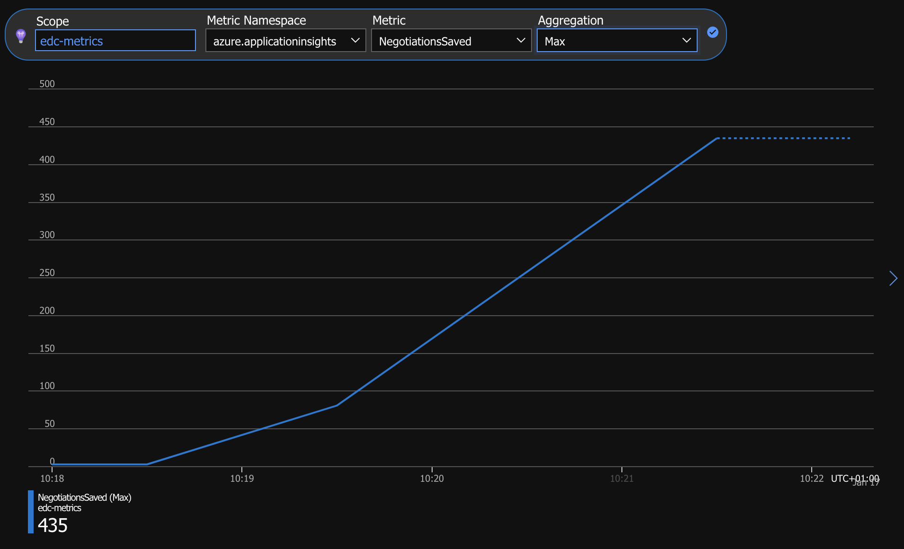
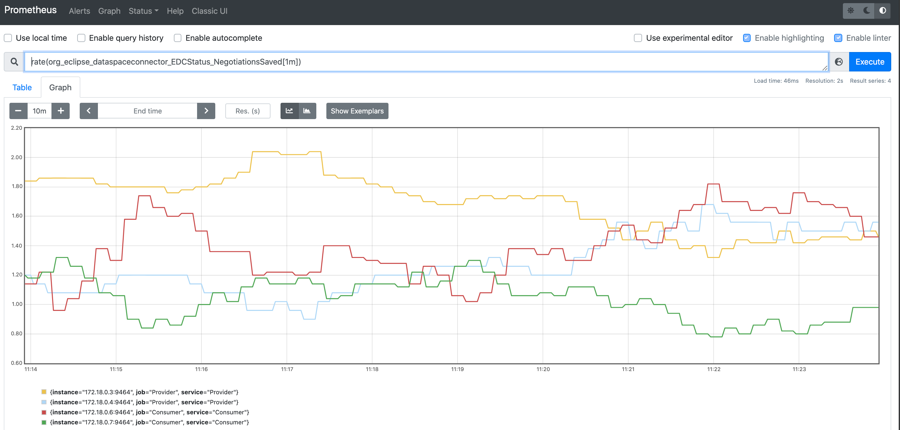

# Micrometer Metrics spike

The sample `04-file-transfer` was adapted to demonstrate collection of metrics using the Micrometer library. Metrics are either exposed through a Prometheus-compatible web endpoint, or automatically collected by the Application Insights agent.

## Usage

### Prerequisites

Download [applicationinsights-agent-3.2.4.jar](https://docs.microsoft.com/en-us/azure/azure-monitor/app/java-in-process-agent#download-the-jar-file) and place it in the project root folder.

To use also Application Insights as a telemetry backend you have to provide `APPLICATIONINSIGHTS_CONNECTION_STRING` property. Copy the content of [`.env.example`](./.env.example) into a newly created `.env` file and fill in the Application Insights connection string.

### Run the demo

```bash
./gradlew clean
./gradlew samples:04-file-transfer:consumer:build
./gradlew samples:04-file-transfer:provider:build
docker-compose --profile prometheus up
```

The docker-compose file spins multiple containers to demonstrate multiple metrics:
- With `--profile azure`: Azure Monitor [Application Insights](https://docs.microsoft.com/azure/azure-monitor/app/app-insights-overview) cloud-native Application Performance Management (APM) service
- With `--profile prometheus`:  [Prometheus](https://prometheus.io/) open-source monitoring system (at [http://localhost:9090](http://localhost:9090))

It also starts containers to fire cURL requests to initiate a contract negotiation process on the consumer connector. This causes EDC to send an HTTP request from the consumer to the provider connector, followed by another message from the provider to the consumer connector. See [the sample README file](samples/04-file-transfer//README.md) for more information about the negotiation process.

### Verify the metrics

#### Application Insights

Monitor the metrics in [metrics explorer](https://docs.microsoft.com/en-us/azure/azure-monitor/essentials/metrics-getting-started).



#### Prometheus

Go to [http://localhost:9090](http://localhost:9090) and browse metrics.

Example: [query number of save operations per minute as measured over the last minute](http://localhost:9090/graph?g0.expr=sum(rate(negotiationsSaved_total%5B1m%5D))%2Fcount(negotiationsSaved_total)*60&g0.tab=0&g0.stacked=0&g0.show_exemplars=0&g0.range_input=5m).



### About the code

In the spike, to keep the code as simple as possible, we create a global singleton `PrometheusMeterRegistry` in the `contract` module, and configure it in the Micrometer [Global registry](https://micrometer.io/docs/concepts#_global_registry).

```java
public static final PrometheusMeterRegistry INSTANCE = new PrometheusMeterRegistry(PrometheusConfig.DEFAULT);
```

```java
Metrics.addRegistry(INSTANCE);
```

We then use the Global registry in application code to create counters. Here we create a simple counter for the number of times a `ContractNegotiation` is saved (created or updated) in the in-memory store.

```java
private Counter saveCounter = Metrics.counter("negotiationsSaved");
```

```java
saveCounter.increment();
```

In the Consumer  Connector Controller, we let the Micrometer Prometheus module generate the metrics data:

```java
@GET
@Path("/metrics")
public String getMetrics() {
  return INSTANCE.scrape();
}
```

Of course, in a production setup we would modularize these components properly.

We can access the Consumer Connector metrics endpoint at [http://localhost:8181/api/metrics](http://localhost:8181/api/metrics):

```sh
> curl http://localhost:8181/api/metrics
# HELP save_total  
# TYPE save_total counter
save_total{type="ContractNegotiation",} 3.0
```

In [the Prometheus server configuration file](prometheus/prometheus.yml), we configure the server to scrape that endpoint.

```yaml
scrape_configs:
  - job_name: services
    metrics_path: /api/metrics
    static_configs:
      - targets:
          - 'consumerP:8181'
```

## Features shown in the spike

- [Micrometer code for instrumenting custom metrics](https://micrometer.io/docs/concepts)
- [Prometheus metrics](https://micrometer.io/docs/registry/prometheus) (using Micrometer Prometheus module)
- [Automatic Micrometer metrics collection in Azure Application Insights agent](https://docs.microsoft.com/azure/azure-monitor/app/java-in-process-agent#send-custom-metrics-by-using-micrometer)
