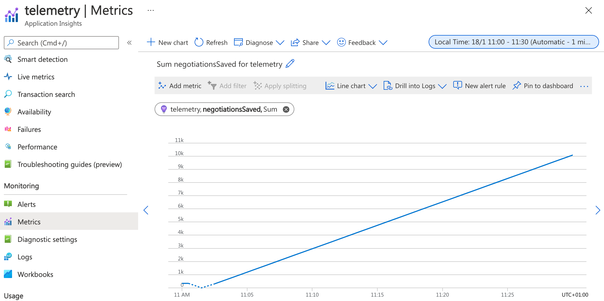

# JMX Metrics spike

The sample `04-file-transfer` was adapted to demonstrate collection of metrics using JMX. Metrics are either exposed through a Prometheus-compatible web endpoint, or automatically collected by the Application Insights agent.

The result of the spike:

- Custom metrics with JMX MBeans 
- Collection of JMX custom metrics by Application Insights
- Exporting JMX metrics to prometheus

## Usage

### Prerequisites

Download [applicationinsights-agent-3.2.4.jar](https://docs.microsoft.com/en-us/azure/azure-monitor/app/java-in-process-agent#download-the-jar-file) and place it in the project root folder.

To use also Application Insights as a telemetry backend you have to provide `APPLICATIONINSIGHTS_CONNECTION_STRING` property. Copy the content of [`.env.example`](./.env.example) into a newly created `.env` file and fill in the Application Insights connection string.

Download [jmx_prometheus_javaagent-0.16.1.jar](https://repo1.maven.org/maven2/io/prometheus/jmx/jmx_prometheus_javaagent/0.16.1/jmx_prometheus_javaagent-0.16.1.jar) and place it in the project root folder.

### Run the demo

```bash
./gradlew clean
./gradlew samples:04-file-transfer:consumer:build
./gradlew samples:04-file-transfer:provider:build
docker-compose --profile prometheus up
```

The docker-compose file spins multiple containers to demonstrate multiple metrics:
- With `--profile azure`: Azure Monitor [Application Insights](https://docs.microsoft.com/azure/azure-monitor/app/app-insights-overview) cloud-native Application Performance Management (APM) service
- With `--profile prometheus`:  [Prometheus](https://prometheus.io/) open-source monitoring system (at [http://localhost:9090](http://localhost:9090))

It also starts containers to fire cURL requests repeatedly to initiate a contract negotiation process on the consumer connector. This causes EDC to send an HTTP request from the consumer to the provider connector, followed by another message from the provider to the consumer connector. See [the sample README file](samples/04-file-transfer//README.md) for more information about the negotiation process.

### Verify the metrics

#### Application Insights

Monitor the metrics in [metrics explorer](https://docs.microsoft.com/en-us/azure/azure-monitor/essentials/metrics-getting-started).



Having an absolute count of operations as a metric is rarely useful, as the representation is a function of both the rapidity with which the counter is incremented and the longevity of the service. Additionally, the counter drops back to zero on a service restart.

Most metric libraries like [Micrometer](https://micrometer.io/docs/concepts#rate-aggregation) perform a rate aggregation automatically before publishing to App Insights. A similar behaviour should be implemented in a JMX based solution.

#### Prometheus

Go to [http://localhost:9090](http://localhost:9090) and browse metrics.

Example: [query number of save operations per second as measured over the last minute](http://localhost:9090/graph?g0.expr=rate(org_eclipse_dataspaceconnector_EDCStatus_NegotiationsSaved%5B1m%5D)&g0.tab=0&g0.stacked=0&g0.show_exemplars=0&g0.range_input=5m).


Similar query, [aggregating by service](http://localhost:9090/graph?g0.expr=sum%20by%28service%29%20%28rate%28org_eclipse_dataspaceconnector_EDCStatus_NegotiationsSaved%5B5m%5D%29%29&g0.tab=0&g0.stacked=0&g0.show_exemplars=0&g0.range_input=5m).


### About the code

An `EDCStatus` MBean is registered using JMX: 

```java
var edcStatus = new EDCStatus();
var objectName = new ObjectName("org.eclipse.dataspaceconnector:name=EDCStatus");
ManagementFactory.getPlatformMBeanServer().registerMBean(edcStatus, objectName);
```

The MBean is later used to track the amount of times a negotiation save operation is performed:

```java
public void save(ContractNegotiation negotiation) {
    delegate.save(negotiation);
    edcStatus.incrementNegotiationsSaved();
}
```
Application Insights is configured to collect the custom JMX metric in `applicationinsights.json`:

```json
{
  "jmxMetrics": [
    {
      "name": "NegotiationsSaved",
      "objectName": "org.eclipse.dataspaceconnector:name=EDCStatus",
      "attribute": "NegotiationsSaved"
    }
  ]
}
```
We set up Docker Compose to deploy multiple replicas per service.

```
services:
  consumerP:
    deploy:
      replicas: 2
```

```
> docker exec -it prometheus nslookup -type=A consumerP
Server:		127.0.0.11
Address:	127.0.0.11:53

Non-authoritative answer:
Name:	consumerP
Address: 172.19.0.6
Name:	consumerP
Address: 172.19.0.4
```

We can access the Consumer Connector metrics endpoint for each replica:

```sh
> docker exec -it prometheus wget -qO - 172.19.0.6:8181/api/metrics                                                                                                            # HELP negotiationsSaved_total  
# TYPE negotiationsSaved_total counter
negotiationsSaved_total 904.0
```

JMX Metrics are exported to a prometheus endpoint by the [JMX exporter agent](https://github.com/prometheus/jmx_exporter). 

```bash
java -javaagent:/app/jmx_prometheus_javaagent-0.16.1.jar=9464:/app/jmx_prometheus_config.yaml
```

In [the Prometheus server configuration file](prometheus/prometheus.yml), we configure the server to scrape the consumer metrics endpoints for the two available replicas.

```yaml
scrape_configs:
  - job_name: Consumer
    dns_sd_configs:
      - names:
          - 'consumerP'
        type: 'A'
        port: 9464
      ...
```

## Features shown in the spike

- [JMX Custom Metrics](https://sysdig.com/blog/jmx-monitoring-custom-metrics/)
- [App Insights Custom JMX Metrics collection](https://docs.microsoft.com/en-us/azure/azure-monitor/app/java-standalone-config#jmx-metrics)
- [Prometheus JMX Exporter](https://github.com/prometheus/jmx_exporter)
