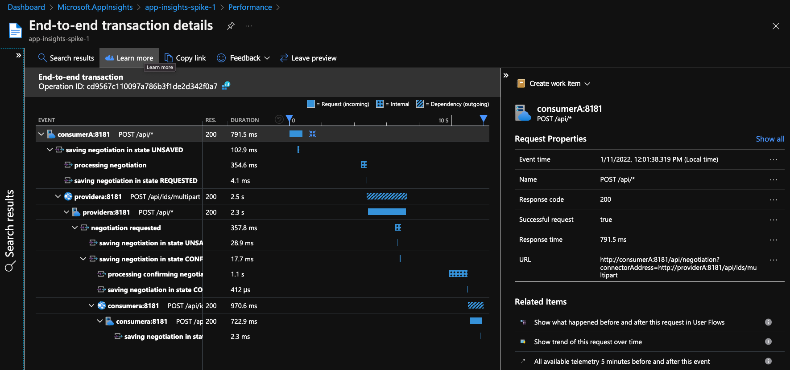
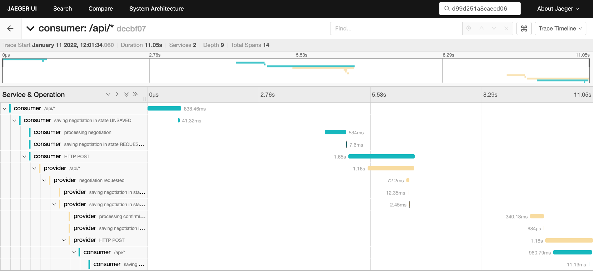
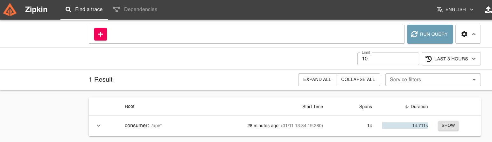
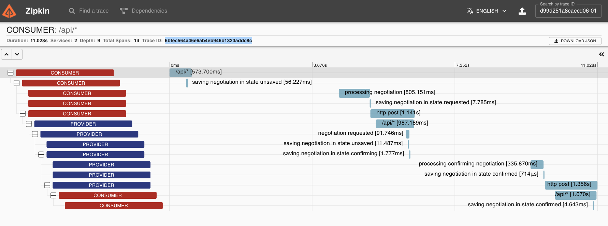

# Telemetry spike

The sample `04-file-transfer` was adapted to demonstrate automatic and manual collection of traces using the Open Telemetry library, together with either the Open Telemetry agent or the Application Insights agent.

The Application Insights agent is compatible with Open Telemetry library code.

## Usage

### Prerequisites

Download [opentelemetry-javaagent.jar](https://github.com/open-telemetry/opentelemetry-java-instrumentation/releases) and [applicationinsights-agent-3.2.4.
jar](https://docs.microsoft.com/en-us/azure/azure-monitor/app/java-in-process-agent#download-the-jar-file) and place them in the project root folder.

To use also Application Insights as a telemetry backend you have to provide `APPLICATIONINSIGHTS_CONNECTION_STRING` property. Copy the content of [`.env.example`](./.env.example) into a newly created `.env` file and fill in the Application Insights connection string.

### Run the demo

```bash
./gradlew samples:04-file-transfer:consumer:build
./gradlew samples:04-file-transfer:provider:build
docker-compose up
```

The docker-compose file spins multiple containers to demonstrate multiple telemetry backends:
- Azure Monitor [Application Insights](https://docs.microsoft.com/azure/azure-monitor/app/app-insights-overview) cloud-native Application Performance Management (APM) service
- [Jaeger](https://www.jaegertracing.io/) open-source distributed tracing system (at [http://localhost:16686](http://localhost:16686))
- [Zipkin](https://zipkin.io/) open-source distributed tracing system (at [http://localhost:9411](http://localhost:9411))

It also starts containers to fire cURL requests to initiate a contract negotiation process on the consumer connector. This causes EDC to send an HTTP request from the consumer to the provider connector, followed by another message from the provider to the consumer connector. See [the sample README file](samples/04-file-transfer//README.md) for more information about the negotiation process.

### Verify the distributed traces

#### Application Insights

Monitor the traces in [Application map](https://docs.microsoft.com/en-us/azure/azure-monitor/app/app-map?tabs=net) or in [transaction diagnostic](https://docs.microsoft.com/en-us/azure/azure-monitor/app/transaction-diagnostics) component.



#### Jaeger

Go to [http://localhost:16686](http://localhost:16686).

Pick **consumer** or **provider** from the Service drop down list and click the **Find Traces** button.


After selecting the trace you should be able to see the transaction diagnostic view of the trace. 



#### Zipkin

The trace should be visible on the Zipkin UI main page: [http://localhost:9411](http://localhost:9411) after clicking RUN QUERY button. You might need to adjust the time constraints filters.



After selecting the trace you should be able to see the transaction diagnostic view of the trace.



### About the code

Without any code changes, basic traces are already produced. However, extending the code greatly improves the quality of the traces.

#### Custom spans

Refactoring "sub-tasks" of a complex operation into methods and annotating the methods with `@WithSpan` is sufficient to capture the timing and state of the sub-tasks:

```java
@WithSpan(value = "processing negotiation")
private void sendOffer(ContractNegotiation process) {
  ...
}
```

Code is generated at runtime by the [OpenTelemetry agent](https://github.com/open-telemetry/opentelemetry-java-instrumentation/blob/main/docs/manual-instrumentation.md). The Application Insights agent is a superset of the OpenTelemetry agent, so it includes its features.

Information about spans can be enhanced by supplying attributes:

```java
@WithSpan(value = "saving negotiation")
@Override
public void save(ContractNegotiation negotiation) {
  Span.current().setAttribute("negotiationState", getStateName(negotiation));
  ... // call code to actually save
}
```

#### Context propagation

Within a thread, the OpenTelemetry agent automatically manages trace headers (e.g. extracting them from an inbound JAX-RS request and inserting them into an outbound OkHttp request). Links between parent and child spans are also created automatically.

When operations are processed asynchronously, we need to help OpenTelemetry perform [Context propagation](https://opentelemetry.io/docs/instrumentation/java/manual_instrumentation/#context-propagation). In our case, incoming `ContractNegotiation` instances are saved to a store (in this simple sample, an basic in-memory store), and another thread advanced these objects through their state machine.

```java
public class ContractNegotiation {
  ...
  
  // Add a field to persist trace information
  private Map<String, String> traceContext;
}
```

For simplicity we have used a mutable `Map` in the spike. In a production setup we would improve that by using the `Builder` class and immutable types.

We need to provide an adapter (`TextMapSetter`) to fill in the data:

```java
public class ContractNegotiationTraceContextMapper implements TextMapSetter<ContractNegotiation> {
    @Override
    public void set(ContractNegotiation carrier, String key, String value) {
        carrier.getTraceContext().put(key, value);
    }
}
```

And use the adapter to write the data from the current span (e.g. derived from the inbound `traceparent` and `tracestate`  HTTP headers):

```java
ContractNegotiationTraceContextMapper traceContextMapper = ...;
ContractNegotiation negotiation = ...;
openTelemetry.getPropagators().getTextMapPropagator().inject(Context.current(), negotiation, traceContextMapper);
```

Similarly, we provide an adapter (`TextMapGetter`) to read the current span information from the `ContractNegotiation` object:

```java
ContractNegotiationTraceContextMapper traceContextMapper = ...;
ContractNegotiation negotiation = ...;
Context extractedContext = openTelemetry.getPropagators().getTextMapPropagator()
.extract(Context.current(), negotiation, traceContextMapper);
extractedContext.makeCurrent();
```

In the spike, to keep the code as simple as possible, we use the global `OpenTelemetry` configuration:

```java
private final OpenTelemetry openTelemetry = GlobalOpenTelemetry.get();
```

Of course, in a production setup we would modularize these components properly, separating API and SDK usage and allowing the application developer to inject their preferred  instance of `OpenTelemetry`, following the [OpenTelemetry Java guidelines](https://opentelemetry.io/docs/instrumentation/java/manual_instrumentation/).


## Features shown in the spike

- [Configuration-based](https://github.com/open-telemetry/opentelemetry-java/blob/main/sdk-extensions/autoconfigure/README.md) exporter to Azure Application Insights, Jaeger and Zipkin.
- [Automatic instrumentation](https://opentelemetry.io/docs/instrumentation/java/automatic_instrumentation/) and trace propagation for Jersey (incoming) and OkHttp (outgoing) HTTP calls.
- [Manual instrumentation](https://opentelemetry.io/docs/instrumentation/java/manual_instrumentation/) for capturing custom spans and events.
- [Custom code for context propagation](https://opentelemetry.io/docs/instrumentation/java/manual_instrumentation/#context-propagation) by capturing the W3C Trace Context HTTP headers in the EDC in-memory store for asynchronous requests.
- [Annotation-driven runtime code generation](https://github.com/open-telemetry/opentelemetry-java-instrumentation/blob/main/docs/manual-instrumentation.md) with the OpenTelemetry agent (`@WithSpan` annotation)
