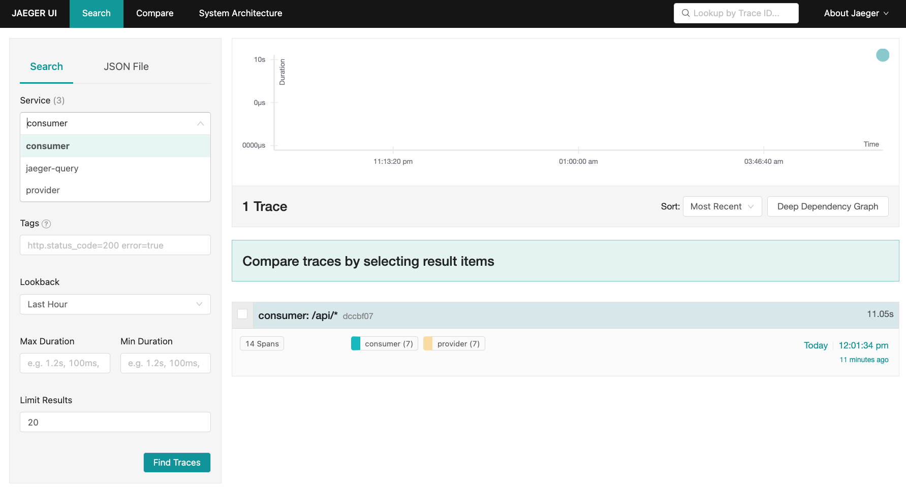

# Telemetry spike

The sample `04-file-transfer` was adapted to demonstrate automatic and manual collection of traces using the Open Telemetry library, together with either the Open Telemetry agent or the Application Insights agent.

The Application Insights agent is compatible with Open Telemetry library code.

## Usage

### Prerequisites

Download [opentelemetry-javaagent.jar](https://github.com/open-telemetry/opentelemetry-java-instrumentation/releases) and [applicationinsights-agent-3.2.4.
jar](https://docs.microsoft.com/en-us/azure/azure-monitor/app/java-in-process-agent#download-the-jar-file) and place them in the project root folder.

To use also Application Insights as a telemetry backend you have to provide `APPLICATIONINSIGHTS_CONNECTION_STRING` property. Copy the content of [`.env.example`](./.env.example) into a newly created `.env` file and fill in the Application Insights connection string.

### Run the demo

```bash
./gradlew samples:04-file-transfer:consumer:build
./gradlew samples:04-file-transfer:provider:build
docker-compose up
```

The docker-compose file spins multiple containers to demonstrate multiple telemetry backends:
- Azure Monitor [Application Insights](https://docs.microsoft.com/azure/azure-monitor/app/app-insights-overview) cloud-native Application Performance Management (APM) service
- [Jaeger](https://www.jaegertracing.io/) open-source distributed tracing system (at [http://localhost:16686](http://localhost:16686))
- [Zipkin](https://zipkin.io/) open-source distributed tracing system (at [http://localhost:9411](http://localhost:9411))

It also starts containers to fire cURL requests to initiate a contract negotiation process on the consumer connector. This causes EDC to send an HTTP request from the consumer to the provider connector, followed by another message from the provider to the consumer connector. See [the sample README file](samples/04-file-transfer//README.md) for more information about the negotiation process.

### Verify the distributed traces

#### Application Insights

Monitor the traces in [Application map](https://docs.microsoft.com/en-us/azure/azure-monitor/app/app-map?tabs=net) or in [transaction diagnostic](https://docs.microsoft.com/en-us/azure/azure-monitor/app/transaction-diagnostics) component.


#### Jaeger

Go to [http://localhost:16686](http://localhost:16686).

Pick **consumer** or **provider** from the Service drop down list and click the **Find Traces** button.



After selecting the trace you should be able to see the transaction diagnostic view of the trace. 


#### Zipkin

The trace should be visible on the Zipkin UI main page: [http://localhost:9411](http://localhost:9411) after clicking RUN QUERY button. You might need to adjust the time constraints filters.


After selecting the trace you should be able to see the transaction diagnostic view of the trace.


## Features shown in the spike

- [Configuration-based](https://github.com/open-telemetry/opentelemetry-java/blob/main/sdk-extensions/autoconfigure/README.md) exporter to Azure Application Insights, Jaeger and Zipkin.
- [Automatic instrumentation](https://opentelemetry.io/docs/instrumentation/java/automatic_instrumentation/) and trace propagation for Jersey (incoming) and OkHttp (outgoing) HTTP calls.
- [Manual instrumentation](https://opentelemetry.io/docs/instrumentation/java/manual_instrumentation/) for capturing custom spans and events.
- [Custom code for context propagation](https://opentelemetry.io/docs/instrumentation/java/manual_instrumentation/#context-propagation) by capturing the W3C Trace Context HTTP headers in the EDC in-memory store for asynchronous requests.
- [Annotation-driven runtime code generation](https://github.com/open-telemetry/opentelemetry-java-instrumentation/blob/main/docs/manual-instrumentation.md) with the OpenTelemetry agent (`@WithSpan` annotation)
