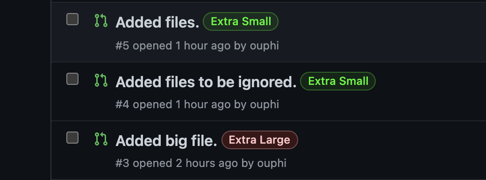
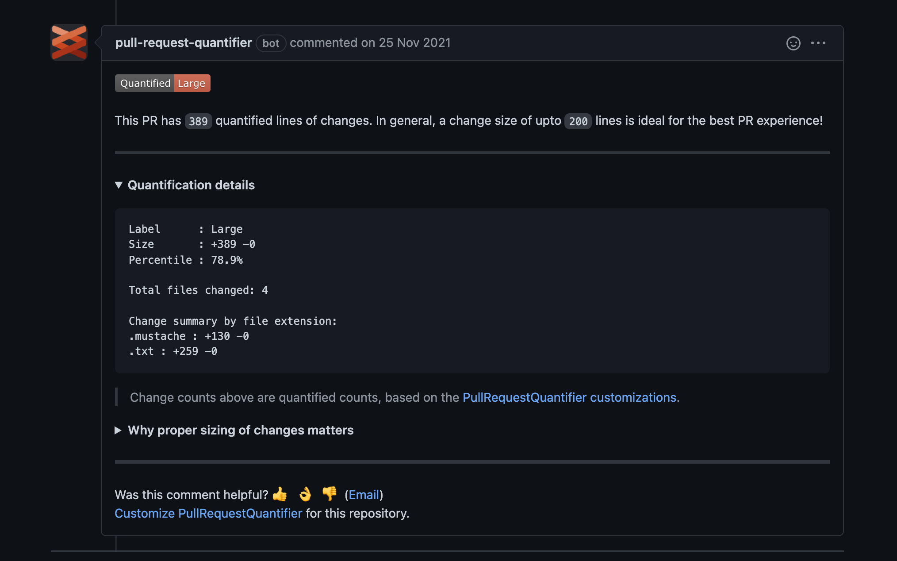

# Tools to display PR size

## PR quantifier

[PR quantifier by Microsoft](https://github.com/microsoft/PullRequestQuantifier).

It is available in the [github marketplace](https://github.com/marketplace/pull-request-quantifier).
It can be installed on the repo level.
It is configurable by adding a [prquantifier.yaml](https://github.com/microsoft/PullRequestQuantifier/blob/main/docs/default-prquantifier-yaml.md) file to the root.

Adds a label size to the PR. When listing the PR we can quickly see the size:

If configured properly the PR quantifier adds a comment with more details about the PR:

